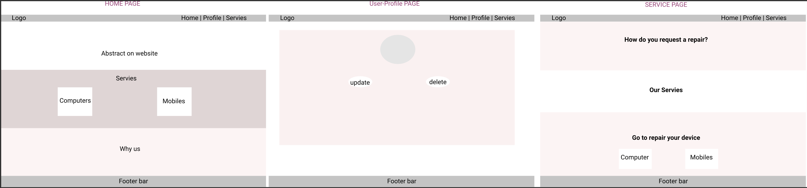
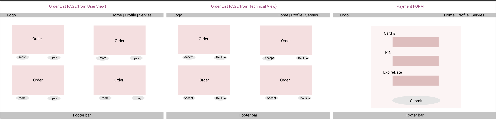
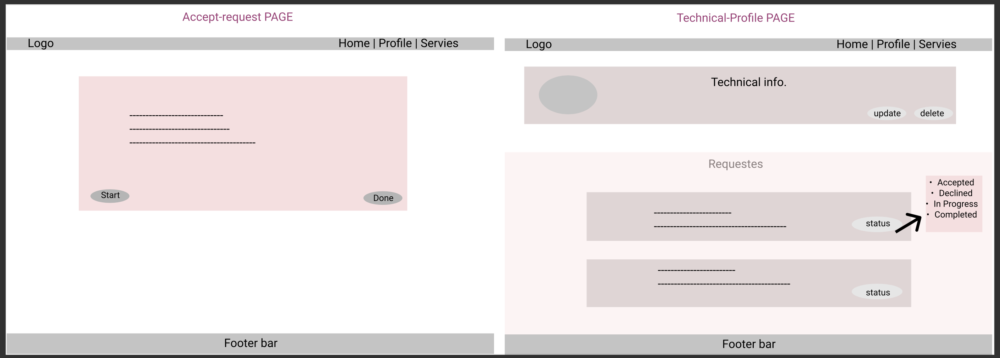
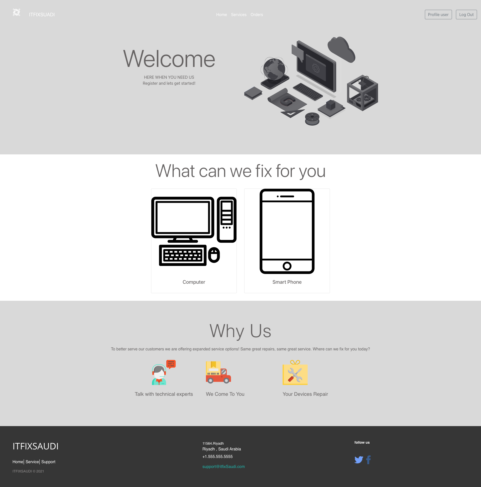
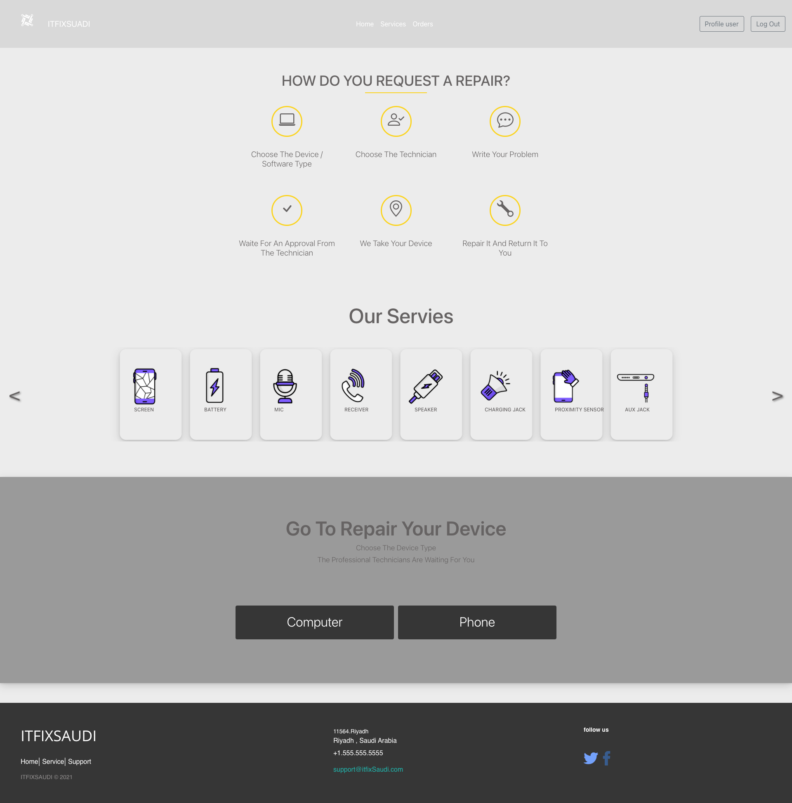

#  ITFixSaudi 

We provide a platform that brings technicians together with customers to provide phone and computer maintenance.

**Team Members**
* Reem Alsenan
* Shahad Albaydhani 
* Muneerah Asiri 

## Important Links
* [backendend repo](https://git.generalassemb.ly/reemalsenan/Project4-backend-SEI15)
* [live website](https://itfixsaudi.herokuapp.com/)

## Planning Story

### Wireframes
<details>
<summary>Wireframe 1</summary>



</details>
<details>
<summary>Wireframe 2</summary>



</details>
<details>
<summary>Wireframe 3</summary>



</details>

### User Stories 
* As a user i can register either as a cutomer or a technician.
* As a user i can login and register.
* As Technician i can pick which type of device i can provide maintenance. 
* As a customer i can pick a technician to fix my device.
* As a customer i can make an order to fix my device.
* As a customer i can pay for the order.
* As a Technician i can either accept or decline the order.

### Demo

<details>
<summary>Home</summary>



</details>
<details>
<summary>Services</summary>



</details>

### Catalog of Routes

#### Order

| Parameter | URI Pattern     | Description                |
| :-------- | :------- | :------------------------- |
| `post` | `/new` |Create a new order |
| `get`    | `/allOrders`| Displays all allOrders
| `get` | `/:id`    | Displays only one order
| `get` | `/allOrders/:id` | Displays the order that contains the user's id
| `get` | `/tech/allOrders/:id` | Displays the order that contains the technician's id
| `put` | `/edit/:id` | Edits the order
|`delete` | `/delete/:id` | Deletes the order 

#### User

| Parameter | URI Pattern     | Description                |
| :-------- | :------- | :------------------------- |
| `post` | `/register` |Saves the registration information and sends an activiation link to the user's email |
| `get` | `/activate/:token` | Activates the user's account and saves the user's data to the database
| `get` | `/:id` | Displays only one user
| `put` | `/update/:id` | Updtes the user's information
| `delete` | `/delete/:id`| Deletes the user 
|`put`| `/changePassword/:id` | Changes the user's password without email.
|`put`| `/forgotPassword`| Sends a reset link to the user's provided email
|`get`| `/resetPassword/:restLink` | Accepts the resetLink token and redirects the user to the correct reset Page
|`put` | `/resetPassword/:resetLink`| Resets the user's password after virifying the reset Token

#### Technician


| Parameter | URI Pattern     | Description                |
| :-------- | :------- | :------------------------- |
| `post` | `/register` |Saves the registration information and sends an activiation link to the technician's email |
| `get` | `/activate/:token` | Activates the technician's account and saves the technician's data to the database
| `get` | `/:id` | Displays only one technician
| `put` | `/update/:id` | Updtes the technician's information
| `delete` | `/delete/:id`| Deletes the technician 
|`put`| `/changePassword/:id` | Changes the technician's password without email.
|`put`| `/forgotPassword`| Sends a reset link to the user's provided email
|`get`| `/resetPassword/:restLink` | Accepts the resetLink token and redirects the technician to the correct reset Page
|`put` | `/resetPassword/:resetLink`| Resets the technician's password after virifying the reset Token

## Installation
```html
npm i // to install all the packages
npm start // to launch the website
```
## What to Add Next
* live chat
* Reviews
* Rating for the technician
* Dark mode

## Technologies 
* HTML/CSS
* JavaScript
* ReactJS
* Bootstrap
* Visual Studio Code
* Heroku
* Axios

## Recources 
* [Trello: used for managing the project](https://trello.com/en)
* [Figma: used for designing the Wireframe ](https://www.figma.com/)
* [Google Fonts](https://fonts.google.com/)
* [Unsplash: images](https://unsplash.com/)
* [Color palette picker](https://coolors.co/)
* [Icons](https://fontawesome.com/)
* [Illustrations](https://undraw.co/search)
* [FreeLogoDesign: used for desigin websit's logo](https://www.freelogodesign.org/)